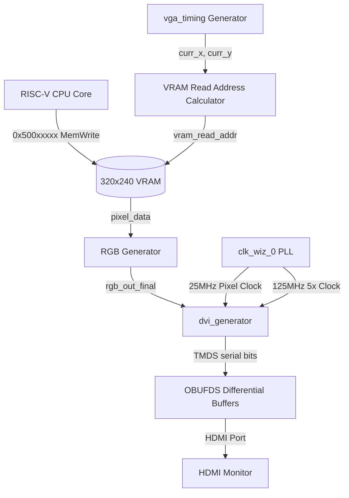

# 🚀 單週期 CPU 外接 HDMI 開發與架構日記

本開發日記針對 `cpu_stage6_vga2` 設計進行架構逆向工程與除錯分析，記錄單週期 RISC-V 核心、顯示記憶體（VRAM）與 HDMI/DVI 傳輸介面的整合設計。

---

## 1. 🛠️ CPU 核心架構設計 (CPU Core Architecture)

### 1.1 指令集支援分析 (ISA Support)
根據 [decoder_rv32](file:///d:/Programing/VerilogProject/miniRV32/src/rtl/decoder.v) 與 [ALU_32](file:///d:/Programing/VerilogProject/miniRV32/src/rtl/ALU_32.v) 的電路實現，目前系統已支援幾乎完整的 **RV32I** 基礎整數指令集：

| 指令類型 | 支援指令 | 解碼器控制訊號特點 |
| :--- | :--- | :--- |
| **R-Type** | `ADD`, `SUB`, `SLL`, `SLT`, `SLTU`, `XOR`, `SRL`, `SRA`, `OR`, `AND` | `RegWrite=1`, `ALUSrc=0`。透過 `funct3` 與 `funct7[5]` 共同產生 `alu_op` 編碼。 |
| **I-Type 運算** | `ADDI`, `SLTI`, `XORI`, `ORI`, `ANDI`, `SLLI`, `SRLI`, `SRAI` | `RegWrite=1`, `ALUSrc=1`。ALU 的第二輸入端切換為經擴展的 `ImmGen` 立即數。 |
| **I-Type Load** | `LW` | `RegWrite=1`, `ALUSrc=1`, `MemRead=1`, `MemtoReg=1`。ALU 進行加法運算計算記憶體位址。 |
| **S-Type Store** | `SW` | `ALUSrc=1`, `MemWrite=1`。不進行暫存器寫回。 |
| **B-Type 分支** | `BEQ`, `BNE`, `BLT`, `BGE` | `Branch=1`。ALU 強制執行減法（`SUB`），透過 ALU 的 `zero` 訊號與 `funct3` 進行跳轉判定。 |
| **J-Type 跳轉** | `JAL`, `JALR` | `RegWrite=1`, `Jump=1`/`Jalr=1`。寫回資料為 `PC + 4`。 |
| **U-Type** | `LUI`, `AUIPC` | `RegWrite=1`。分別啟用 `Lui` 與 `Aui` 控制訊號。 |

### 1.2 單週期架構 Datapath 特點
在 [top.v](file:///d:/Programing/VerilogProject/miniRV32/src/rtl/top.v) 中，系統在一個時脈週期內完成**擷取 (Fetch)、解碼 (Decode)、執行 (Execute)、訪存 (Memory)、寫回 (Write-back)** 五個階段：
* **指令擷取 (Fetch)**：由 `PC` 模組讀取目前位址，直接從唯讀的指令記憶體 `IMEM` 中並行取出 32-bit 指令。
* **分支判定**：在同一週期內計算跳轉目標（`PC + Imm` 或 `Reg + Imm`），若分支條件成立（`take_branch` 成立），立即將跳轉目標送回 `PC` 的輸入端，於下一個上升沿更新 PC。
* **周邊記憶體映射 (MMIO)**：透過位址解碼實現對外部硬體的直接讀寫。
  * **按鈕輸入**：映射位址 `0x4000_0000`。讀取該位址時，多路選擇器會選取外部 `btn` 連接至寫回資料總線。
  * **VRAM 寫入**：映射位址範圍 `0x500xxxxx`。當 `MemWrite` 為高且位址匹配時，將暫存器資料寫入顯示記憶體。

---

## 2. 📺 VRAM 顯示系統與 HDMI 對接 (VRAM & HDMI Interface)

系統藉由硬體描述，將處理器的記憶體總線與 HDMI 影像傳輸電路無縫接合，形成一個雙埠（Dual-Port）概念的顯示系統。



### 2.1 VRAM 定址與雙埠特性
* **規格與容量**：目前在 `top.v` 中宣告為單色（1-bit）的區塊記憶體 `reg [0:0] vram [0:76799]`，對應高達 **320x240** 的解析度，總像素點為 76,800 個。
* **CPU 寫入端**：映射於位址區間 `0x500xxxxx`。當指令執行 `SW` 到此區間，`is_vram` 訊號拉高，在系統時脈的上升沿，將暫存器輸出值最低位 `rd2[0]` 寫入 VRAM 內由 `alu_out[16:0]` 指定的索引值。
* **影像讀取端**：顯示控制器以標準 VGA 的 25MHz 像素時脈運作。為了將 320x240 的 VRAM 解析度映射到標準 640x480 的螢幕上，讀取端採用了**座標折半（除以 2）** 的縮放策略，讀取位址計算如下：
  $$vram\_read\_addr = (vga\_y[9:1] \times 320) + vga\_x[9:1]$$
  這使得 VRAM 中的每個像素點在橫向與縱向皆被重複描繪 2 次，完美填滿 640x480 螢幕。

### 2.2 HDMI / DVI 模組對接原理
影像輸出透過 [dvi_generator](file:///d:/Programing/VerilogProject/miniRV32/src/rtl/dvi_generator.v) 將並行的色彩與同步訊號轉為 HDMI 差分訊號：
1. **時鐘倍頻**：利用 PLL `clk_wiz_0` 產生同步且相位相符的 25MHz（像素時脈）與 125MHz（5 倍高頻時脈）。
2. **TMDS 編碼**：[tmds_encoder_dvi](file:///d:/Programing/VerilogProject/miniRV32/src/rtl/tmds_encoder_dvi.v) 將 8-bit 的紅、綠、藍色彩數據及 `hsync`/`vsync` 控制訊號編碼為 10-bit 的最小化傳輸差分訊號（TMDS），以達成直流平衡（DC-balanced）。
3. **並行轉序列 (OSERDES)**：[serializer_10to1](file:///d:/Programing/VerilogProject/miniRV32/src/rtl/serializer_10to1.v) 呼叫 Xilinx 的 `OSERDESE2` 原語（Master-Slave 模式），工作在雙倍數據速率（DDR）下。在高頻 125MHz 的驅動下，每個時脈週期發送 2 bits，將 10-bit TMDS 數據序列化輸出。
4. **單端轉差分**：在 `top.v` 中，將序列化後的單端 TMDS 訊號送入 `OBUFDS` 原語，轉換為 HDMI 連接器物理層所需之對稱式差分訊號。

---

## 3. ⏳ 開發進化史回顧 (Evolution History)

從極簡架構到整合 HDMI 的 SoC 系統，本專案的演進歷程可合理推演為六大硬體設計里程碑：

* **Stage 1：核心運算單元設計 (ALU & Decoder Validation)**
  * *任務*：完成基礎算術邏輯單元與解碼器。
  * *挑戰*：避免 Case 語句未覆蓋全導致 Latch 產生，並確立 32 位元資料路徑寬度。
* **Stage 2：狀態元件與指令擷取 (PC & RegFile Integration)**
  * *任務*：導入 Program Counter (PC) 與 32 組通用暫存器組 (`RegFile`)。
  * *挑戰*：確保在同一上升沿，PC 遞增與暫存器寫入不會發生時序衝突。
* **Stage 3：分支控制流建立 (Program Execution & Branching)**
  * *任務*：實現 `BEQ`、`BNE`、`JAL` 等跳轉指令。
  * *挑戰*：計算跳轉目標位址（PC + Imm）並處理單週期內的方向分支判定。
* **Stage 4：記憶體訪存與資料擴展 (Data Memory & Load/Store)**
  * *任務*：整合 `data_mem` 與 `ImmGen` 立即數擴展單元，實現 `LW` 和 `SW` 指令。
  * *挑戰*：設計結構化的立即數抽取邏輯，將 R-I-S-B-U-J 各種不同格式的指令立即數字段正確還原為 32 位元有號數。
* **Stage 5：周邊設備映射與基礎顯示 (MMIO & Low-Res Display)**
  * *任務*：引進 MMIO 控制匯流排，設計簡易的 16x16 像素 `vram`，使用 VGA 同步訊號驅動外設。
  * *挑戰*：完成非同步讀取與同步寫入的雙埠快取架構，防止顯示畫面產生雜訊或破圖。
* **Stage 6：高頻 HDMI 與序列化傳輸 (Full HDMI & PLL Tuning)**
  * *任務*：導入 `OSERDESE2` 與 `OBUFDS` 原語，改採 DVI 數位差分傳輸。
  * *挑戰*：從 VGA 類比同步訊號轉為數位編碼，並對 PLL 時脈相位校正，解決時域跨越與高速串列傳輸的信號完整性問題。

---

## 4. 🔍 當前卡關痛點診斷 (Hardware Debugging & Pitfalls)

目前燒錄到 PYNQ-Z2 開發板後螢幕毫無反應（無畫面），其電路設計與約束中存在以下三個最致命的「死穴」：

### 🛑 痛點 1：重置訊號極性相反（導致電路處於永久重置狀態）
* **設計現況**：
  * 在 [PYNQ-Z2 v1.0.xdc](file:///d:/Programing/VerilogProject/miniRV32/src/constraints/PYNQ-Z2%20v1.0.xdc) 中，將 `rst_n` 腳位連接到實體按鍵 `btn[0]` (D19)。
  * PYNQ-Z2 開發板上的 Push Button 電路為**主動高電平（Active-High）**。當按鈕沒有被按下時，腳位透過下拉電阻處於低電平（`0`）；按下時才為高電平（`1`）。
  * 然而，程式碼中的 CPU 核心、VGA 時序器皆是以**低電平重置（Active-Low, !rst_n）** 作為重置條件。
* **致命後果**：當開發板上電後，如果沒有人用手指按住 `btn[0]`，`rst_n` 腳位會一直讀入 `0`，這意味著系統**一直處於重置狀態**。時序產生器與 CPU 均被鎖死。
* **解決方案**：在頂層模組中，將按鍵信號進行反相處理後再送入核心：
  ```verilog
  wire sys_rst_n = !rst_n; // 按下按鈕時為 0 (重置)，放開時為 1 (正常工作)
  ```

### 🛑 痛點 2：HDMI 實體引腳與約束檔嚴重對位錯誤（TMDS 通路斷開）
* **設計現況**：
  * 在 [PYNQ-Z2 v1.0.xdc](file:///d:/Programing/VerilogProject/miniRV32/src/constraints/PYNQ-Z2%20v1.0.xdc) 中，第 185-188 行為 HDMI Tx 的物理映射：
    ```xdc
    set_property -dict { PACKAGE_PIN L19  IOSTANDARD TMDS_33  } [get_ports { TMDS_data_p[1] }];
    set_property -dict { PACKAGE_PIN L20  IOSTANDARD TMDS_33  } [get_ports { TMDS_data_n[1] }];
    set_property -dict { PACKAGE_PIN J18  IOSTANDARD TMDS_33  } [get_ports { TMDS_data_p[2] }];
    set_property -dict { PACKAGE_PIN J19  IOSTANDARD TMDS_33  } [get_ports { TMDS_data_n[2] }];
    ```
  * 然而對比 PYNQ-Z2 官方線路圖與第 36-37 行的定義：
    * `L19` 和 `L20` 實際上是開發板上的 **按鈕 btn[3] 與 btn[2]** 的引腳！
    * 官方 HDMI Tx Channel 1 的引腳應為 `K19` (p) 與 `J19` (n)；Channel 2 應為 `J18` (p) 與 `H18` (n)。
* **致命後果**：
  1. HDMI 的 Channel 1 被接到了開發板的實體按鈕電阻上，根本沒有送入 HDMI 接頭。
  2. HDMI 的 Channel 2 的負端（`TMDS_data_n[2]`）被接到了 `J19`，這是 Channel 1 的引腳！這導致通道 1 與通道 2 的信號在晶片內部錯位且短路。
  3. 影像接收端因無法偵測到完整的 3 個 TMDS 資料通道差分訊號，將直接判定為「無訊號輸入」。
* **解決方案**：將 `.xdc` 的 HDMI 腳位修正為正確的官方引腳：
  ```xdc
  set_property -dict { PACKAGE_PIN K19  IOSTANDARD TMDS_33  } [get_ports { TMDS_data_p[1] }]; # K19
  set_property -dict { PACKAGE_PIN J19  IOSTANDARD TMDS_33  } [get_ports { TMDS_data_n[1] }]; # J19 (原本誤植為 channel 2_n)
  set_property -dict { PACKAGE_PIN J18  IOSTANDARD TMDS_33  } [get_ports { TMDS_data_p[2] }]; # J18
  set_property -dict { PACKAGE_PIN H18  IOSTANDARD TMDS_33  } [get_ports { TMDS_data_n[2] }]; # H18 (原本誤植為 J19)
  ```

### 🛑 痛點 3：`rgb_out_final` 單線路雙驅動衝突 (Multiple Drivers)
* **設計現況**：
  * 在 [top.v](file:///d:/Programing/VerilogProject/miniRV32/src/rtl/top.v) 的後半部分，存在以下兩行程式碼：
    * 第 114 行：
      ```verilog
      wire [23:0] rgb_out_final = (vga_active && pixel_data) ? 24'hFFFFFF : 24'h000000;
      ```
    * 第 127 行：
      ```verilog
      assign rgb_out_final = vga_active ? {vga_x[7:0], vga_y[7:0], 8'hFF} : 24'h000000;
      ```
* **致命後果**：`rgb_out_final` 作為同一個 `wire` 類型訊號，在程式中被指派了兩個不同的硬體邏輯驅動源（一個是 CPU 影像繪製，另一個是彩條測試圖）。這在 Verilog 中屬於嚴重的**多驅動衝突 (Multiple Drivers)**。
  * Vivado 在 Synthesis 或 Implementation 階段通常會跳出 `Critical Warning` 或 `Error`。
  * 即使勉強通過，硬體也會因為信號爭搶，導致輸出波形一直處於不確定的 `X` 態或直接拉低，使 TMDS 編碼器編碼出錯誤的控制碼，螢幕無法顯示任何畫面。
* **解決方案**：使用一個選擇器切換這兩種顯示模式（例如使用實體開關或定義控制暫存器），或者直接將其中一行註解掉。
